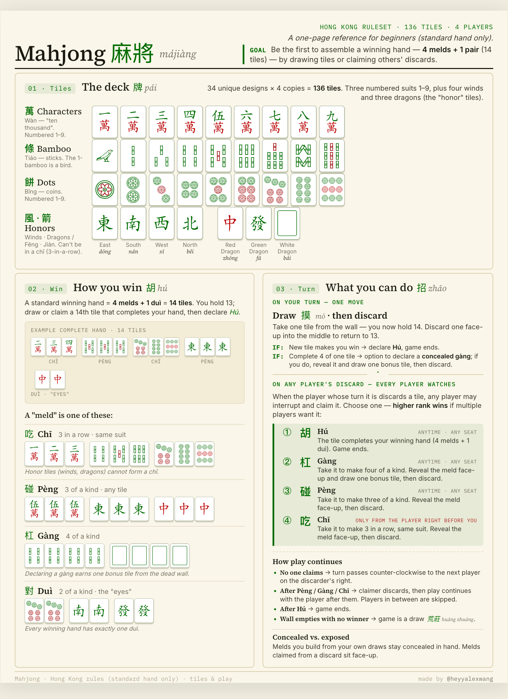
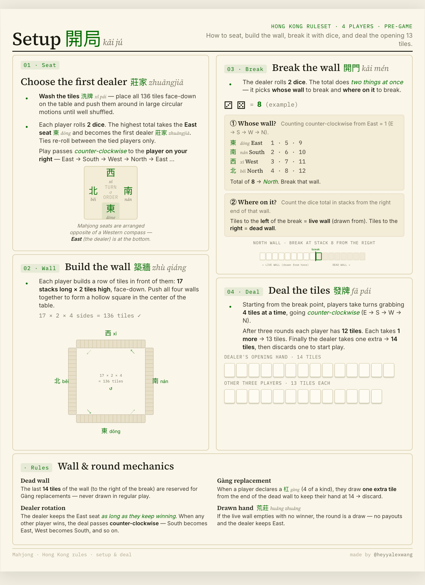

# Mahjong Cheatsheet — Printable Reference

  
  

Two, single-page, print-ready reference for Hong Kong–style Mahjong, aimed at **beginners**. It only covers the **standard hand** (4 melds + 1 pair) — special hands, scoring/faan, and house variants are out of scope. Designed to fit on US Letter, so you can hand a copy to every player at the table.

- **`src/player-cheatsheet.html`** ([PDF](player-cheatsheet.pdf)) — the tiles, how you win, and what you can do on your turn.
- **`src/dealer-cheatsheet.html`** ([PDF](dealer-cheatsheet.pdf)) — how to seat, build the wall, break with dice, and deal the opening 13 tiles.

Open either file in a browser, then print to PDF. Pre-rendered PDFs are at the repo root.

## Printing

Print on **US Letter (8.5 × 11 in), portrait**. In the browser's print dialog:

- **Paper size:** Letter
- **Margins:** None (or "Default" — the page sets its own 0.4in margins internally)
- **Scale:** 100% / "Actual size" (do not "fit to page")
- **Background graphics:** On (so the jade accents and tile borders render)

## Disclaimer

Content and visual style are adapted from **[themahjong.guide](https://themahjong.guide/)**.
